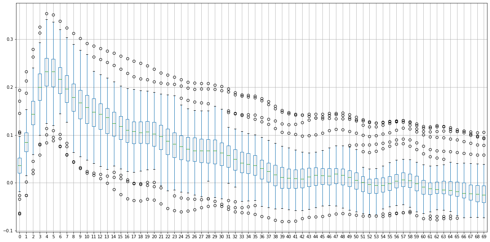

# Witaj w XXX 

To repozytorium zawiera kod części serwerowej odpowiedzialnej za wyznaczanie predykcji poziomu wody na Odrze w miejscowości Głogów. Predykcje generuje model ML uczony na danych historycznych (wejściem są pomiary opadów w stacjach pomiarowych w dorzeczu Odry) oraz odczytach poziomu wody w Głogowie. 

Całość aplikacji została przygotowana w trakcie hackatonu CuValleyHack organizowanego przez KGHM. 

Więcej o samym algorytmie i procesie uczenia modelu znajduje się w dedykowanej sekcji temu poświęconej. 

Aplikacja jest dostępna pod adresem:
https://mf57.github.io/water-level-estimator-frontend/

## Struktura aplikacji

XXX jest aplikacją webową z częścią frontendową dostępną w osobnym repozytorium:

https://github.com/MF57/water-level-estimator-frontend

Front aplikacji jest szczegółowiej opisany w poświęconym mu repozytorium.

Częścią backendową dostępną w tym repozytorium. W repozytorium zamieszczone są:

1. Dockerfile - plik pozwalający zbudować aplikację i spakować ją w obraz dockerowy. Gotowe obrazy są dostępne w repozytorium: https://hub.docker.com/repository/docker/passarinho/miedz/general
Dzięki temu mozliwe było szybkie uruchomienie jej na serwerze VPS jednego z uczesników a take przy wykorzystaniu znanych narzędzi jak nginx reverse proxy, czy letsencrypt zapewnienie bezpiecznego (HTTPS) połączenia między częścią frontendową i backendową aplikacji.

2. Folder app/ - zawiera przygotowany model AI (o którym wiecej w części mu poświęconej), a takze kod serwera HTTP (wykorzystuje do tego znany framework Flask), udostępniający endpoint, który dla zadanej daty zwraca kolejne dni z predykcją poziomu wody na Odrze w Głogowie. Dodatkowo kazdy z datapointów jest wzbogacony o bląd, w celu lepszej wizualizacji. 

3. Folder lab/ - zawiera kod w Pythonie (dokładniej notebooki pythonowe), które zostały uzyte do przygotowania modelu uzywanego w produkcyjnej aplikacji. Zawieraja fragmenty przygotowania danych (sparsowanie dostarczonych przez organizatora plików CSV), przygotowania ich - np. Połączenie danych o opadach z dwóch stacji z miasta Cieszyn, czy zamienienia NaN na 0. 

## Przygotowanie danych 

Proces przygotowania danych polegał na sparsowaniu danych dostarczonych przez organizatora, a następnie:
- Zmergowanie danych ze stacji z miasta Cieszyn (w trakcie pomiarów następiła zmiana numeru stacji)
- Klasteryzacja z uzyciem algorytmu K-means do 7 klastrow. Klateryzacja była na podstawie współrzednych geograficznych. 
- Dla kazdego klastra zostala wyliczona srednia opadow dla kazdego dnia

## Inne testowane podejścia i mozliwe rozszezenia

### Czy odległość miejsca pomiaru opadów od Głogowa ma duze znaczenie na to po jakim czasie poziom wody w rzece w Głogowie wzrośnie?
Nie ma to większego znaczenia, z policzonych korelacji wychodzi, ze bez wiekszego znaczenia jest jak daleko opady były od Głogowa. Mozna to wytłumaczyć w ten sposób, ze wodzie więcej czasu zabiera spływanie po powierzchni ziemi niz kiedy juz plynie szybko korytem rzeki. 
 Najlepsza korelacja jest dla 5 dni przesunięcia. 

### Podczas analizy danych i probie zrozumienia problemu spisalismy nastepujace parametry, ktore powinny poprawic dokladnosc predykcji:
- Temperatura powietrza w miejscu pomiaru opadu (wysoka temperatura powoduje szybsze parowanie, zas ujemna oznacza śnieg)
- Grubość pokrywy śnieznej - moze być pomocne przy szacowaniu roztopow i ich wplywu na poziom wody
- Polozenie zbiorników retencyjnych i ich napełnianie/opróznianie
- Wigotnosc powietrza
- Fazy księzyca ;)
- Topografie terenu - mapy nie byly przez nas brane pod uwagę

## Model AI
Do modelu wykorzystana została sieć LSTM składająca się z 6 warstw Long-Short memmory oraz jednej warstwy wyjściowej. 

 

